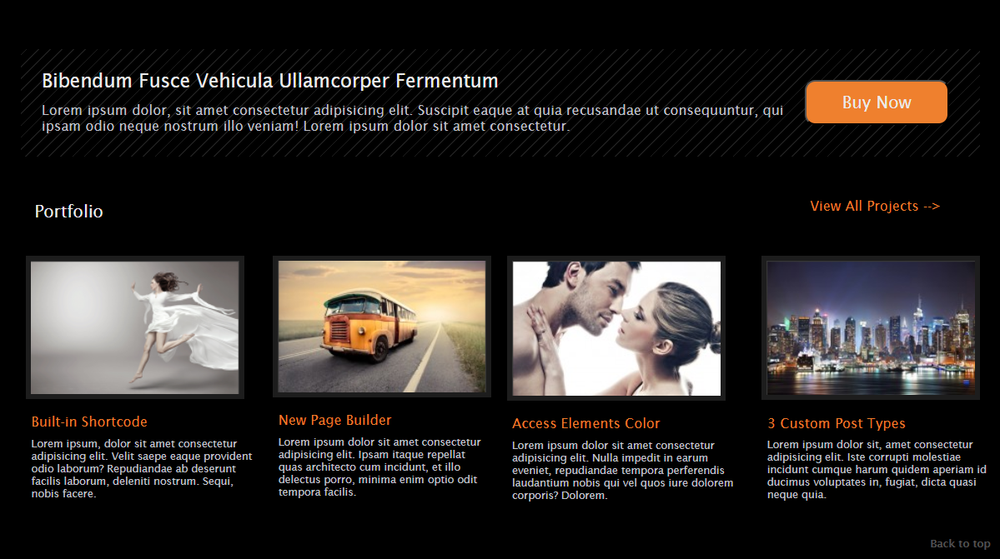

## Modernize Redesign – Responsive Web Demo

---

## Overview 

This project is a modernized version of a static webpage I originally built while learning web development fundamentals. The original site used non-semantic HTML, lacked responsiveness, included placeholder content, and relied on minimal design principles.

This updated version maintains the structure and general visual identity of the original while applying modern best practices in HTML, CSS, and UX/UI design.

---

## Goals of the Redesign

- Preserve the original for historical and learning comparison
- Implement semantic HTML5 for better accessibility and structure
- Refactor layout to be fully responsive across devices
- Replace filler text with more realistic content
- Update images to better match the content theme
- Apply small but impactful design improvements for better usability and visual polish
- Add enhancements such as smooth scrolling for improved navigation experience

---

## Key Improvements

- Semantic HTML: Converted div-heavy structure into appropriate elements, including `<header>`, `<nav>`, `<section>`, `<article>`, and `<footer>` 
- Responsive Design: Used flexbox and media queries to ensure the site adapts to various screen sizes
- Content Realism: Replaced all placeholder text (e.g., "Lorem ipsum") with more meaningful copy
- Visual Enhancements: Improved spacing, typography, and color contrast for better readability and accessibility
- Smoother Interactions: Introduced smooth scrolling and improved navigation structure
- Cleaner CSS: Reorganized styles for readability and modularity, removed inline styles

---

## Features

- ✅ **Modern, Semantic HTML5 Structure**  
  Clear document outline using `<header>`, `<main>`, `<section>`, and `<footer>` for better structure, SEO, and accessibility.

- 📱 **Fully Responsive Layout**  
  Mobile-first design adapts to various devices using Flexbox and media queries.

- 🎨 **Updated Visual Design**  
  Enhanced spacing, typography, and layout for a cleaner and more professional appearance.

- ♿ **Accessibility Enhancements**  
  - Color contrast meets WCAG AA standards  
  - Keyboard navigable interface  
  - Clear heading hierarchy and proper use of alt text  
  - Improved screen reader support with semantic structure

- 🧭 **Consistent Navigation**  
  Streamlined top navigation with smooth scroll behavior and clear hover/focus states.

- 🛠️ **Maintainable Codebase**  
  Organized CSS, modular structure, and separation of concerns for future updates and scalability.

---

## Design Principles & Best Practices

This redesign prioritizes both form and function by applying industry-standard principles:

- **Semantic HTML5**  
  Improves document structure, accessibility, and maintainability by using descriptive, meaningful tags instead of generic containers.

- **User-Centered Design (UCD)**  
  Layout and content choices were guided by clarity, ease of navigation, and visual hierarchy to support user goals.

- **Usability & Accessibility (W3C/WCAG & Section 508 Compliance)**  
  - Proper use of ARIA roles and landmark elements  
  - Logical tab order and keyboard-friendly design  
  - Descriptive link text and informative alt attributes  
  - Sufficient color contrast and responsive font sizes

- **Responsive Web Design**  
  Built using mobile-first principles and tested across multiple screen sizes to ensure a consistent and user-friendly experience.

- **Separation of Concerns**  
  Visual design is handled via external CSS, improving readability and maintainability of the HTML markup.

---

## Tech Stack

- HTML5 (semantic structure)
- CSS3 (Flexbox, media queries)

---

## Notes

- The original project used the lang="zxx" attribute, which was updated in the redesign for proper accessibility.
- Inline styles and visual separators (like |) in menus were refactored using external CSS for maintainability.

---

## Project Comparison

| Feature                        | Original Project                           | Updated Version                                         |
|--------------------------------|--------------------------------------------|---------------------------------------------------------|
| **HTML Structure**             | `
`-heavy, non-semantic elements       | Semantic HTML (`<header>`, `<main>`, `<section>`, etc.) |
| **Responsiveness**             | Fixed-width layout                         | Responsive layout using modern CSS                      |
| **Text Content**               | Generic lorem ipsum                        | More realistic and purposeful placeholder text          |
| **Imagery**                    | Lower resolution, default placeholders     | Higher quality, relevant images                         |
| **Design & Styling**           | Basic styles, static layout                | Enhanced design with improved spacing and hierarchy     |
| **Accessibility**              | Minimal alt text, limited considerations   | Improved alt text, semantic tags for assistive tech     |
| **UX Improvements**            | Basic navigation                           | Smooth scroll, refined spacing, and visual flow         |

---

## Original Version

The original static HTML version of this project is available here:  
👉 [View Original Project on GitHub](https://github.com/MsMLyons/Modernize-Project)

---

## Screenshots

### Original (Desktop)

### Redesigned (Desktop)

---

## Author

Created by [Marki Lyons](https://mlyons-portfolio.netlify.app)  
&copy; 2025

---

## License

This project is for educational and demonstration purposes only.